# FoldForge

> A differentiable computational origami engine. Give it a target 3D shape or a
> target mechanical behavior; it designs the crease pattern that folds into it,
> simulates the fold with physics accuracy, and lets you watch and edit the fold
> live in 3D.

FoldForge is built milestone by milestone, each one runnable and useful on its
own. **All seven milestones (M0-M6) are implemented**, plus the capstone:
**the Origamizer**, which takes *any* 3D shape (a surface, a height field, even
a photo) and designs a pleated sheet that folds into it. It's pure numpy +
matplotlib (plus Three.js for the studio), no deep-learning framework, with
gradients verified against finite differences.

**The capstone: watch a flat sheet fold itself into a 3D dome** (folded result
in beige, target surface in cyan, the fold lands on the target):

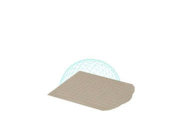

And the simulator folding a Miura-ori (rigid panels, ~1% strain):

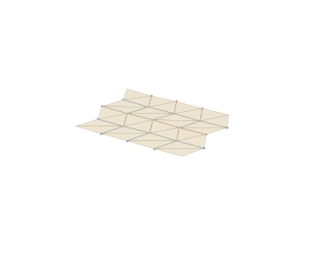

## The whole pipeline at a glance

| | Milestone | What it does | Demo |
|---|---|---|---|
| **M0** | Geometry + theory | FOLD I/O, crease graph, Kawasaki/Maekawa validators | `docs/img/miura.png` |
| **M1** | 3D fold simulator | rigid-panel dynamic relaxation, <1% strain | `miura_fold.gif` |
| **M2** | Differentiable kinematics | gradients through a fold, verified vs finite diff | notebook |
| **M3** | Inverse design | gradient descent from a target shape to a fold | `inverse_design.png` |
| **M4** | Generative model | a net proposes folds, simulator-in-the-loop, ~10-100x > random | `generative.png` |
| **M5** | Metamaterials | Miura auxetic Poisson's ratio + inverse design | `metamaterial.png` |
| **M6** | Web studio | Three.js viewer: pick a shape, fold it, rotate + scrub | `studio/index.html` |
| **★** | **Origamizer** | **decompose any 3D shape / image into a foldable crease pattern** | `origamize.png` |

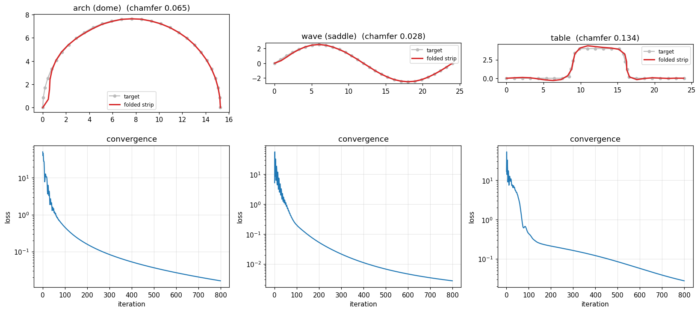
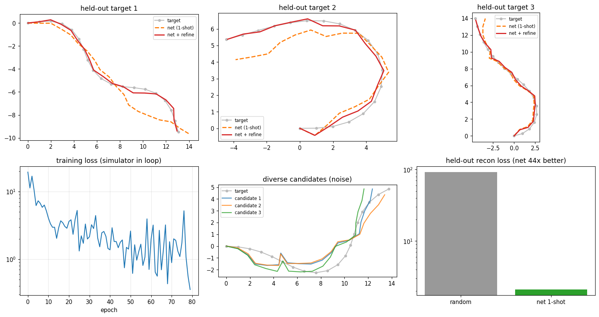
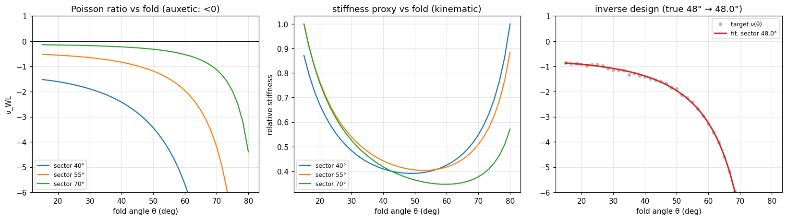

The differentiable core also includes an **exact, closed-form 2D Miura
tessellation** (`diff/miura.py`). It's isometric to machine precision and
inverse-designable: fold it to fit a target box at a target height.

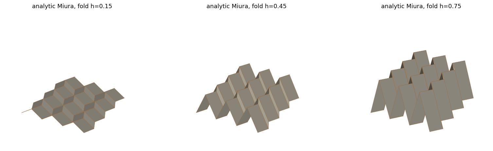
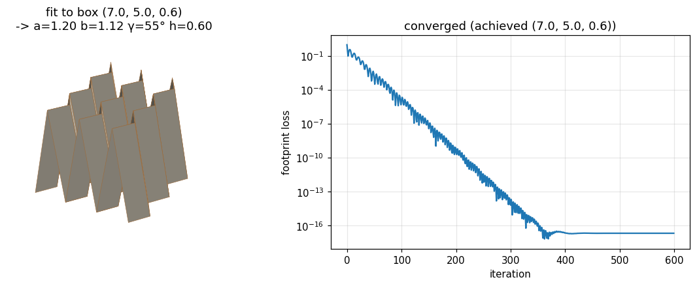

---

## ★ The Origamizer: fold any 3D shape

Hand it a target and it designs the pleated sheet that folds into it, using
*corrugation through inverse design*: the sheet is modelled as parallel rigid
fold-chains, and each chain's fold angles are solved (via the M2/M3
differentiable core) to match the target's cross-section. The result is a real
crease pattern (a FOLD file you can open in other origami tools) plus the folded
geometry. Every intermediate fold is an exact rigid state too, so the animation
above genuinely folds onto the target.

```python
from foldforge.origamize import origamize_heightfield, heightfield_dome
r = origamize_heightfield(heightfield_dome())
r.pattern      # a real crease pattern (CreasePattern, exportable to FOLD)
r.folded       # the folded 3D vertices
r.error        # how closely the fold matches the target
```

It folds **any input** through one path: a height field, an analytic surface,
or a photo (brightness → relief):

```python
from foldforge.origamize import origamize_image, origamize_function
origamize_image("face.png")                      # estimate a relief and fold it
origamize_function(lambda x, y: x**2 - y**2)     # fold a saddle
```

**Fold an animal from a photo.** `origamize_image` uses raw brightness (so the
background folds too). To fold *the subject*, `origamize_silhouette` estimates
its shape: segment it from the background (GrabCut), inflate the silhouette into
a rounded bas-relief, then fold that:

```python
from foldforge.origamize import origamize_silhouette
result, relief = origamize_silhouette("cat.jpg")   # segment + inflate + fold
```

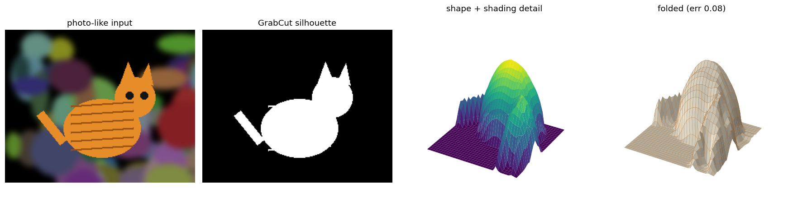

(Needs `opencv-python` + `scipy`. The subject is found automatically with an
edge-density saliency heuristic, so it need not be centred; pass an explicit
`rect=(x, y, w, h)` to override. Also on the command line as `foldforge origamize
cat.jpg cat.fold --silhouette`, or `foldforge fold cat.jpg cat.stl` for a
watertight solid in one step.)

**Or estimate its actual relief.** Silhouette mode inflates the subject into a
rounded balloon. Monocular *depth* mode instead predicts genuine per-pixel
distance with a depth network, masks it to the subject with the same GrabCut
segmentation, and folds that. MiDaS small is the default (needs only PyTorch);
DPT_Hybrid is a sharper opt-in (it needs `timm`).

```python
from foldforge.origamize import origamize_depth
result, relief = origamize_depth("zebra.jpg")                          # MiDaS_small
result, relief = origamize_depth("zebra.jpg", model_type="DPT_Hybrid") # sharper edges
```

On a zebra photo, silhouette inflation folds to error 0.148 (it's now a rounded
*spherical-cap* balloon, which reproduces a disc's analytic hemisphere ~14x more
faithfully than the old `distance**0.5` law). MiDaS depth folds to 0.239,
higher, because a fuller, more truthful relief carries more high-frequency
detail than a single corrugation can reproduce, but it follows the animal's true
near/far structure instead of a smooth blob. DPT_Hybrid resolves depth edges
~19% sharper than MiDaS small (at a similar fold error). Both need
`pip install foldforge[depth]`. On the command line: `foldforge origamize
zebra.jpg zebra.fold --depth [--depth-model DPT_Hybrid]`. Rendered proofs live in
`examples/output/`.

**Match a subject's sides (`symmetry=`).** A real photo of a symmetric subject
(a butterfly, a face-on animal) is almost never shot perfectly square-on, so the
estimated relief comes out lopsided (one wing bigger than the other). Pass
`symmetry="auto"` to detect the subject's best mirror axis, align it to vertical,
and average the relief with its mirror so both sides match; `"x"`/`"y"` force
top-bottom / left-right, and `"off"` (default) leaves the photo as shot. `auto`
only fires when the silhouette really is left-right symmetric (mask mirror-IoU
above a threshold), so a turned or side-on subject is left untouched.

```python
from foldforge.origamize import origamize_silhouette
result, relief = origamize_silhouette("butterfly.jpg", symmetry="y",
                                      engine="miura2d")   # wings match exactly
```

On the blue-morpho sample, a 9-degree camera tilt drives the height field's
left/right mirror-RMSE to 0.385; `symmetry="auto"` recovers the axis and drops it
to 0.000, and the wings come out identical. On the command line:
`foldforge fold butterfly.jpg butterfly.stl --engine miura2d --symmetry auto`.
Before/after figures: `examples/output/butterfly_symmetry.png` and
`butterfly_offaxis_symmetry.png`.

Three surfaces decomposed (target on top, folded origami below):

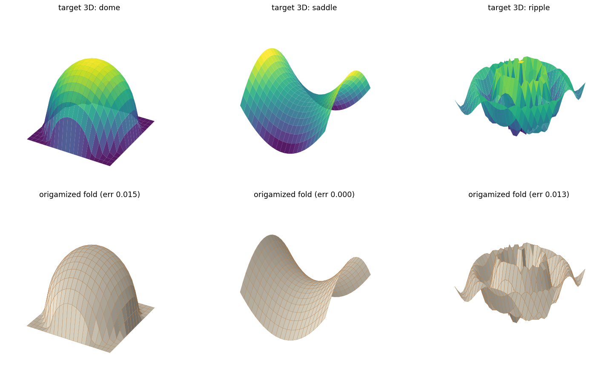

Estimating a relief from an image and folding it:

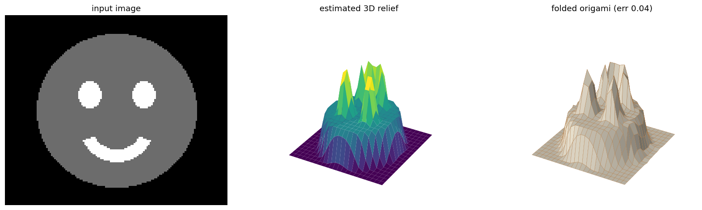

**Honest scope:** this is a *corrugation* approximation (the simplest member of
the surface-origami family), not full Origamizer tuck-folding. A single
extruded profile is exactly developable (a genuine flat-foldable sheet); a full
2D height field is approximated as independent pleated strips, with the
approximation error reported. And the two photo modes estimate shape rather than
measure it: silhouette mode *inflates* a mask, and depth mode folds a monocular
*prediction* of relief, not ground-truth geometry. The interactive studio
(`studio/index.html`) lets you fold the dome, saddle, ridge, and Miura and watch
each land on its target.

---

## ★★ The 2D origamizer: a genuine crease pattern (`--engine miura2d`)

The corrugation above folds each row of the height field as an **independent**
1D pleat chain. Every strip reproduces its own cross-section, but the strips are
not one sheet: the single crease pattern that path can honestly return is an
*extruded profile* (constant across the sheet), so folding it makes a **ridge,
not a dome**. That is the 1D bound.

The `miura2d` engine breaks it. It fits a genuine **2D warped-Miura
tessellation**: two crease families meeting at degree-4 vertices, the way real
origami-tessellation surface approximations (Tachi's freeform Miura) work. The
folded vertices and the flat crease pattern are optimised *together* (Adam over
the same edge-length / vertex quantities the differentiable core already uses).
The folded **mid-surface tracks the target**, every folded edge keeps its flat
length (a near-rigid fold), and every facet stays planar. Because a flat
(developable) sheet has zero Gaussian curvature, a curved target cannot be hit
with *zero* strain; the residual fold strain is **measured and reported**, not
hidden.

```python
from foldforge.origamize import origamize_miura, compare_engines, heightfield_dome
r = origamize_miura(heightfield_dome())
r.pattern        # a real 2D crease pattern: M + V creases, quad faces (FOLD/SVG-exportable)
r.folded         # the folded 3D surface, mid-surface tracking the target
r.error          # normalised mid-surface RMSE vs the target
r.mean_strain, r.max_strain      # fold validity (isometry residual)

compare_engines(heightfield_dome())   # {'corrugation_error': .., 'miura2d_error': ..}
```

On the command line it is one flag (corrugation stays the default):

```bash
foldforge fold      cat.jpg cat.stl --engine miura2d    # photo -> true-2D folded solid
foldforge origamize zebra.jpg zebra.fold --engine miura2d
```

**Fidelity: it wins clearly on every curved subject.** The metric is one
callable (`surface_fit_error`): the normalised RMSE of the folded **mid-surface**
against the target height field after a best scale + offset alignment, run
**identically** on both engines. For the corrugation it scores the *coherent
single-sheet* fold of its returned pattern (the extrusion), the honest
like-for-like comparison of "fold the one crease pattern each engine hands you".

| target | corrugation (1D) | **miura2d (2D)** | miura2d fold strain (mean / max) |
|---|---|---|---|
| hemisphere | 0.276 | **0.017** | 0.23% / 1.8% |
| saddle | 0.166 | **0.001** | 0.15% / 0.9% |
| radial ripple | 0.202 | **0.023** | 0.43% / 5.5% |
| zebra (photo) | 0.322 | **0.035** | 0.38% / 2.3% |
| cat (photo) | 0.343 | **0.029** | 0.43% / 4.1% |
| dog (photo) | 0.278 | **0.015** | 0.29% / 2.2% |
| elephant (photo) | 0.290 | **0.011** | 0.20% / 1.1% |

(Mid-surface error is 8-200× lower across these targets: the low end is
the gentlest relief, the high end the least-favourable corrugation reading. The
comparison basis is the single sheet each engine actually returns, scored by the
identical metric. Reproduce with `pytest tests/test_miura2d_fit.py` and
`compare_engines`.)

**Validity, honestly.** The flat crease pattern is a planar sheet (trivially
developable) with real mountain/valley creases *and* the triangulating facet
diagonals, all exported to layered SVG (diagonals on their own facet layer) and
FOLD. Because those diagonals are exported, every face in the FOLD file is a
triangle, so each exported panel is planar to machine precision (the folded
pattern matches the geometry: the earlier quad export bowed ~1.5 cm out of plane
on a 24 cm sheet). The fold is near-rigid: mean edge strain ≈ 0.2-0.5%, on par
with the simulator's own rigid Miura (~0.6%), with the worst strain concentrated
where the target's curvature is highest; max strain is typically below ~5% but
runs higher (up to ~6-7%) at extreme aspect ratios or curvature peaks, and the
engine warns when it does. It is **not flat-foldable** (Kawasaki fails),
correctly so: a curved relief cannot also collapse flat. The corrugation's
single profile *is* flat-foldable, but only because it is a ridge. A `miura2d`
`.fold` loads and folds live in the studio (in-browser PBD solver, ~2% bar
strain).

**Still honest about the ceiling.** This is relief / tessellation origami: a
warped Miura whose corrugation absorbs the target's Gaussian curvature. It is
**not** Origamizer arbitrary-3D tuck-folding: it approximates height fields
(and photo reliefs), not closed surfaces or overhangs, and it trades a little
fold strain for the huge fidelity gain rather than being an *exact* rigid fold.

---

## What Milestone 1 gives you (the 3D fold simulator)

A solver that takes a flat crease pattern and **folds it into 3D**, after
Ghassaei, Demaine & Gershenfeld's Origami Simulator (2018):

- **Rigid-panel mesh**: faces become triangles held rigid by stiff length
  springs; creases and the triangulation diagonals become hinges.
- **Dynamic-relaxation fold**: hinge forces drive each crease toward a target
  fold angle while length projection keeps the panels rigid; the fold is ramped
  flat → folded and a snapshot saved per stage.
- **Actuation**: rigid origami is a mechanism, so you can drive one crease
  family and let the rest follow (`creases_along_x`), giving the clean uniform
  Miura fold.
- **Built-in rigidity check**: every result carries the worst per-face strain;
  the Miura and waterbomb both fold at well under 1% strain.
- **Verified crease math**: the dihedral-angle gradient the forces rest on is
  checked against finite differences in the test suite (and sets up M2).

```python
from foldforge.geometry import examples
from foldforge.sim import FoldMesh, fold, creases_along_x

mesh = FoldMesh.from_pattern(examples.miura(4, 4))
result = fold(mesh, fold_fraction=0.85, actuate=creases_along_x(mesh))
print(result.max_strain)     # ~0.006  -> panels stayed rigid
result.vertices              # (V, 3) folded coordinates
```

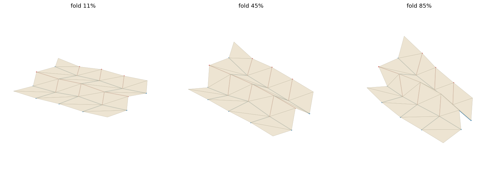

The waterbomb base (a 3D base, not a flat fold) pops into shape the same way:

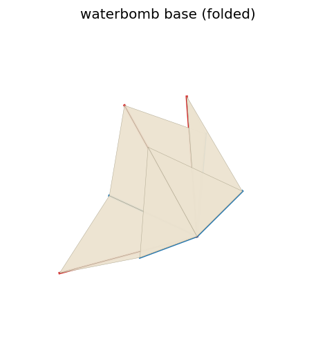

**Honest limitations.** The model doesn't test for self-intersection, so panels
can pass through each other at deep folds. And the relaxation finds *a* valid
rigid fold, not a guaranteed-unique one. Both are noted where relevant and are
fine for this stage.

---

## What Milestone 0 gives you (geometry + theory)

A small, clean library for working with *flat* crease patterns:

- **Read/write the FOLD format**: the JSON standard for crease patterns
  (`github.com/edemaine/fold`), so FoldForge files open in other origami tools.
- **A crease-graph model** (`CreasePattern`): vertices, edges with
  mountain/valley/border assignments, faces, and the geometric query everything
  leans on: the *sector angles* around each vertex.
- **Foldability validators**: Kawasaki's and Maekawa's theorems, checked per
  interior vertex and rolled up into a whole-pattern verdict.
- **A flat-pattern renderer**: mountains red, valleys blue, border black.
- **Built-in example generators**: Miura-ori, a single-vertex pattern, and the
  waterbomb base.

Here is the Miura-ori it generates, validates, and renders:

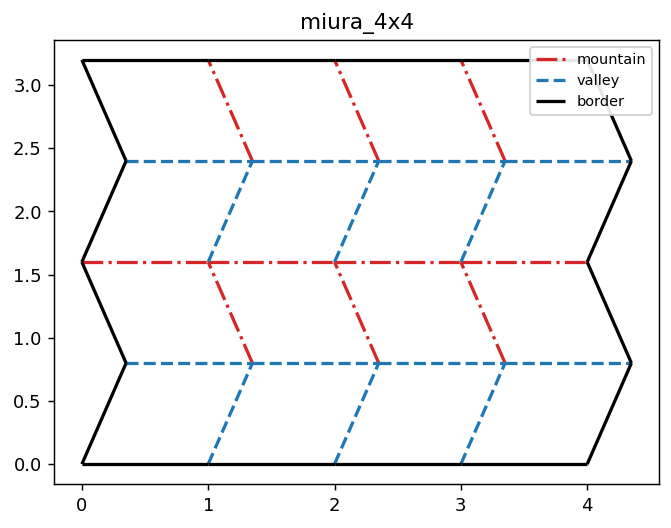

---

## Install

```bash
cd Foldforge
python -m pip install -e .              # core (numpy + matplotlib only)
python -m pip install -e ".[dev]"       # + pytest, to run the tests
python -m pip install -e ".[vision]"    # + opencv/scipy: photo segmentation, solver speedup
python -m pip install -e ".[depth]"     # + torch/timm: monocular-depth photo folding
python -m pip install -e ".[jax]"       # + jax: optional autodiff/GPU backend
```

Python 3.10+. The extras are additive, so `".[vision,depth]"` combines them.

## Quickstart

**Fold a photo into a 3D-printable mesh in one command:**

```bash
foldforge fold cat.jpg cat.stl      # auto-segment the subject, fold it, close a watertight solid
```

No hand-tuned rectangle: it finds the subject on its own (edge-density saliency +
GrabCut), folds its estimated relief (keeping the subject's own aspect ratio,
not a forced square), and writes the mesh by extension (`.stl` / `.glb` /
`.obj`). Needs `pip install -e ".[vision]"`. Two dials shape the result:

```bash
foldforge fold cat.jpg cat.stl --folds 12          # fewer, bigger folds (rougher, simpler)
foldforge fold cat.jpg cat.stl --detail rough      # preset alias: rough=12 / medium=24 / fine=40
foldforge fold cat.jpg cat.stl --style origami     # low-poly folded-paper facets
```

- **`--folds N`** sets how many creases span the subject's longer side: lower is
  rougher and simpler, higher is finer (default ~40); `--detail rough|medium|fine`
  are presets for 12/24/40.
- **`--style`** picks **`smooth`** (default: a rounded, inflated relief) or
  **`origami`** (posterises the relief into a few large flat facets with sharp,
  straight creases, a low-poly folded-paper look).

Add `--depth` for monocular-depth relief or `--open-sheet` for the one-sided
sheet. It prints a short summary:

```
Folded cat.jpg -> cat.stl  (silhouette, smooth style, folds=40)
  subject coverage :   41% of the sheet  (auto-segmented)
  fold match error : 0.021
  closed solid (watertight): 3516 triangles, 606 KB
```

**Or fold live in the browser:** open `studio/index.html` and **drag a photo**
(or a `.fold` file) **onto it**, or pick a built-in shape (dome, saddle, ridge,
two-peaks, Miura) and scrub the fold slider. No build step, no server.

**In Python:**

```python
from foldforge.geometry import examples
from foldforge import foldability_report, render_pattern
import matplotlib.pyplot as plt

pattern = examples.miura()                 # a 4x4 Miura-ori
print(foldability_report(pattern).summary())   # -> flat-foldable (passes both theorems)

render_pattern(pattern)
plt.show()
```

Load your own FOLD file instead:

```python
from foldforge import read_fold
pattern = read_fold("examples/miura.fold")
```

## Command line

```bash
foldforge fold   cat.jpg cat.stl                  # photo -> folded 3D mesh (one command)
foldforge gen    miura examples/miura.fold        # write a built-in example
foldforge check  examples/miura.fold              # report foldability
foldforge render examples/miura.fold out.png      # render to an image
foldforge origamize zebra.jpg zebra.fold --depth  # fold a photo (--silhouette / --depth)
foldforge export zebra.fold zebra.svg             # layered SVG/DXF for a cutter
```

## Run the demos

- **M0 notebook:** `notebooks/M0_geometry.ipynb`: patterns, foldability, and
  catching a corrupted Miura.
- **M1 notebook:** `notebooks/M1_simulator.ipynb`: folds the Miura and waterbomb
  into 3D and plots the strain history (the rigidity proof).
- **M2-M5 notebook:** `notebooks/M2-M5_design_pipeline.ipynb`: differentiable
  kinematics, inverse design, the generative model, and the metamaterial
  mechanics, end to end. (All outputs are embedded, so you can read without running.)
- **Web studio (M6):** open `studio/index.html` in any browser, drag to rotate,
  scrub the fold slider, watch the built-in shapes fold, or **drag a photo / `.fold`
  file onto the window** to fold your own.
- **Sample gallery:** `python examples/make_samples.py` folds the flat,
  clean-silhouette sample subjects from `examples/samples/`
  into closed printable solids and renders `examples/output/animals_showcase.png`
  (photo → segmented height-field heatmap → folded solid, one row per subject).
  Sample photos are scaled from Wikimedia Commons files (see each file page for
  its license): [Morpho didius Male Dos MHNT.jpg](https://commons.wikimedia.org/wiki/File:Morpho_didius_Male_Dos_MHNT.jpg) (blue morpho butterfly, CC BY-SA 4.0),
  [Papilio thoas thoas MHNT dos.jpg](https://commons.wikimedia.org/wiki/File:Papilio_thoas_thoas_MHNT_dos.jpg) (swallowtail butterfly, CC BY-SA 4.0),
  [Saturnia pyri MHNT dos.jpg](https://commons.wikimedia.org/wiki/File:Saturnia_pyri_MHNT_dos.jpg) (giant peacock moth, CC BY-SA 4.0),
  [Autumn Ginkgo Leaf.jpg](https://commons.wikimedia.org/wiki/File:Autumn_Ginkgo_Leaf.jpg) (ginkgo leaf, CC BY-SA 3.0),
  [White starfish on beige background.jpg](https://commons.wikimedia.org/wiki/File:White_starfish_on_beige_background.jpg) (starfish, CC0),
  [Carassius wild golden fish 2013 G1 (white background).jpg](https://commons.wikimedia.org/wiki/File:Carassius_wild_golden_fish_2013_G1_(white_background).jpg) (goldfish / Prussian carp, public domain).
- **Tests:** `pytest -q` runs 149 tests across all milestones (plus one that skips
  when JAX isn't installed): the two theorems, FOLD round-tripping, the
  dihedral-gradient and kinematics finite-difference checks, the implicit
  gradient and its analytic sparse Hessian against finite differences, fold
  rigidity, inverse-design convergence, the generator beating random, the Miura
  coming out auxetic, collision-free fold sequencing, glTF/OBJ export, and the
  origamizer producing accurate, foldable patterns from surfaces, images, and
  monocular depth.

---

## The two theorems, briefly

Both are checked at every *interior* vertex (border vertices are exempt).

**Kawasaki's theorem.** Sweep around a vertex and label the wedge angles between
consecutive creases `a1, a2, a3, ...`. The pattern can fold flat only if the
alternating sum is zero: `a1 - a2 + a3 - ... = 0`. Because the wedges always sum
to 360°, that's the same as the odd wedges totalling 180° and the even wedges
totalling 180°.

**Maekawa's theorem.** At an interior vertex of a flat-foldable pattern, the
number of mountain folds minus the number of valley folds is exactly `+2` or
`-2`.

**Honesty note.** These are *necessary*, not *sufficient*. Failing either proves
a pattern can't fold flat. Passing both is a strong signal but not a proof: the
paper's layers can still collide globally. The waterbomb base example exists to
show the validators correctly saying "no": it passes Kawasaki (all 45° wedges)
but fails Maekawa, because it's a 3D base, not a flat fold.

---

## Project layout

```
foldforge/
  geometry/
    crease_graph.py   # CreasePattern: the data model + sector-angle geometry
    fold_io.py        # read/write the FOLD JSON format
    foldability.py    # Kawasaki + Maekawa, per-vertex and whole-pattern
    render.py         # flat (2D) and folded (3D) renderers
    examples.py       # Miura / single-vertex / waterbomb generators
  sim/
    mesh.py           # FoldMesh: triangulate + extract bars/hinges; dihedral math
    solver.py         # dynamic-relaxation fold solver + actuation (sparse fast path)
    collision.py      # self-intersection detection (spatial hash) + repulsion
    sequencing.py     # collision-free fold ordering: greedy + beam search
  diff/
    kinematics.py     # M2: differentiable fold chain + analytic Jacobian
    miura.py          # M2+: exact differentiable 2D Miura tessellation
    implicit.py       # general-solver gradients (IFT) + analytic sparse Hessian
  design/
    inverse.py        # M3: gradient-descent inverse design + targets
  generative/
    model.py          # M4: amortised generator, simulator-in-the-loop training
  materials/
    mechanics.py      # M5: Miura Poisson's ratio, stiffness, inverse design
  origamize/
    surface.py        # ★ decompose a 3D target (profile/height field) to a fold
    io.py             # ★ fold any input: image / function / 3D point cloud
    shapes.py         # ★ wild targets: text, procedural terrain, OBJ meshes
    vision.py         # ★ photo -> subject: GrabCut segment + silhouette inflate
    depth.py          # ★ photo -> relief: MiDaS / DPT_Hybrid monocular depth
  fabricate/export.py # SVG / DXF (cutters) + OBJ / STL / glTF (folded 3D)
  jaxsim/             # optional JAX backend: autodiff + GPU (drop-in)
  cli.py              # `foldforge check | render | gen | origamize | export`
studio/               # M6: single-file Three.js viewer (+ in-browser image folding)
examples/             # generated .fold / .svg / .dxf files; output/ = zebra proofs
notebooks/            # demo notebooks (M0, M1, M2-M5, M7 origamizer)
tests/                # pytest suite (149 tests)
docs/img/             # rendered patterns, fold stages, GIFs, design figures
```

Core dependencies are **numpy + matplotlib only**, no deep-learning framework.
The kinematics, the generative model's backprop, the implicit-function-theorem
gradients, and the optimisers are all hand-written numpy, with gradients verified
against finite differences. **JAX is an optional backend** (`pip install jax`)
that reproduces those gradients automatically and runs on GPU.

---

## Roadmap

| Milestone | What it adds | Status |
|---|---|---|
| **M0** | Geometry + foldability theory core | ✅ done |
| **M1** | Forward 3D fold simulator (rigid panels + hinges) | ✅ done |
| **M2** | Differentiable kinematics (verified gradients) | ✅ done |
| **M3** | Inverse design (target shape → fold) | ✅ done |
| **M4** | Generative model (propose folds, simulator in the loop) | ✅ done |
| **M5** | Origami metamaterials (auxetic mechanics + inverse design) | ✅ done |
| **M6** | Interactive 3D web studio | ✅ done |

## Beyond the roadmap

Since the seven milestones, FoldForge has grown the capabilities its own
roadmap called for next, all tested:

- **Fabrication export** (`fabricate/`): write any crease pattern to layered
  **SVG/DXF** (mountain=red, valley=blue, border/cut=black) ready for a laser or
  vinyl cutter. `foldforge origamize photo.png out.fold` then export to cut it.
- **Wilder shapes** (`origamize/shapes.py`): fold **text/logos**, **procedural
  terrain**, and **OBJ meshes**, on top of images and surfaces. Gallery:

  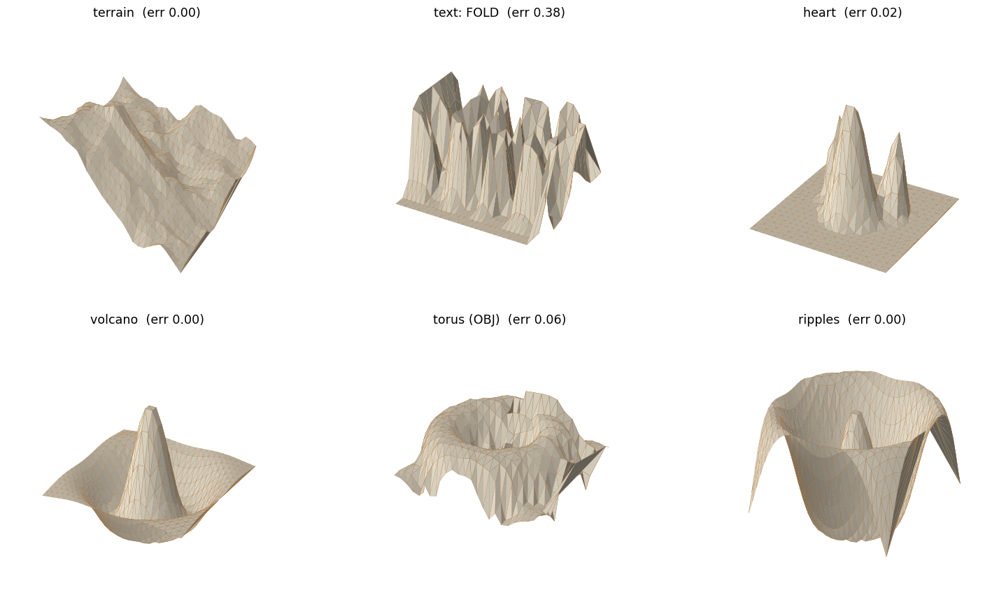

- **Self-intersection detection** (`sim/collision.py`): spatial-hash broad
  phase + triangle/triangle narrow phase flags panels that pass through each
  other, with an optional soft repulsion (`fold(..., avoid_intersection=True)`).
- **Collision-aware fold sequencing** (`sim/sequencing.py`): searches an order
  in which to fold the creases so panels get out of each other's way, scoring
  trial folds with the collision detector. Greedy by default; a `beam_width`
  turns on beam search, which keeps several partial orderings alive and never
  returns a worse ordering than greedy. It's a heuristic search, not an
  exhaustive proof of a collision-free order.
- **Implicit differentiation of the general solver** (`diff/implicit.py`):
  gradients through the folded *equilibrium* of an arbitrary crease graph via the
  implicit function theorem (one linear solve at the fixed point), verified
  against finite differences. The Hessian for that solve is now assembled
  analytically and sparsely, `O(V)` rather than `O(V^2)`, matching the old
  finite-difference Hessian to ~1e-8 and running 7-14x faster at 48-108 DOFs
  (the gap widens with size). This closes the "general solver isn't
  differentiable" gap.
- **Optional JAX backend** (`jaxsim/`): the pure-numpy core ports to
  `jax.numpy`, so `jax.grad` reproduces the hand-derived gradients automatically
  (exact to 1e-9) and runs on GPU.
- **Folded-3D export** (`fabricate/to_obj` / `to_stl` / `to_gltf`): save the
  folded shape as OBJ, STL, or a self-contained glTF `.glb` (written by hand, no
  new dependency) to 3D-print it or open it in any viewer (`OrigamiResult`
  carries its triangles). OBJ and glTF can tint each vertex by the crease type it
  touches (mountain red, valley blue). Crease patterns still export to layered
  SVG/DXF for cutters.
- **Faster solver**: the length-projection hot loop runs as sparse matrix
  multiplies when SciPy is present (~2x on large patterns), byte-identical to the
  numpy path, with a clean numpy fallback.
- **Richer animal folding**: `origamize_silhouette` blends the inflated
  silhouette with edge-preserving interior shading (`detail=`), so the folded
  subject shows surface features instead of a smooth blob; `origamize_depth`
  goes further and folds a monocular *depth* prediction (MiDaS small, or
  DPT_Hybrid with `timm`) of the subject's real near/far structure. Proven on a
  real zebra photo (`examples/output/`): silhouette fold error 0.148, MiDaS
  depth 0.239.
- **Web studio upgrades** (`studio/index.html`, regenerated by
  `examples/make_studio.py`): drop in your own photo and watch it fold in the
  browser as blank paper by default, with a **Photo texture** toggle to wrap the
  fold in the image and a **3-stage pipeline strip** (input photo → raw height
  field → symmetrized height field, tagged with the mask mirror-IoU) that
  replaces the old separate heatmap/reference panels; a **Symmetry** select
  (Off / Auto / Force, default Auto, the mirror-IoU score shows in the status
  bar) mirroring the CLI's `--symmetry`; a collapsible **showcase gallery** of
  baked sample results (blue morpho butterfly and its symmetrized version,
  swallowtail, giant peacock moth, ginkgo leaf, starfish, and goldfish, each
  engine-labelled with a **Load** button); load your own
  `.fold` and fold it with an in-browser rigid-origami PBD solver (a loaded
  Miura folds at 0.17% strain with the crease signs recovered), download the
  current frame as OBJ, plus soft shadows and a ground plane.

### Honest scope notes

- Differentiability now spans three routes: exact closed-form families (fold
  chain, 2D Miura) with analytic gradients, the **general** energy solver via
  implicit differentiation (with an analytic sparse Hessian), and the optional
  JAX autodiff backend.
- The **M5** mechanics are *kinematic* (geometry-only): they reproduce the right
  trends (the Miura's negative Poisson's ratio) but are not a validated stress
  analysis.
- Self-intersection is now **detected** and can be softly penalised, and
  `fold_sequence` searches for a collision-free fold order (greedy or beam), but
  neither guarantees a globally collision-free fold; the search is heuristic,
  not exhaustive.
- The origamizer has two engines. The default **corrugation** is a 1D
  approximation (exact for extruded profiles; independent pleated strips, with
  reported error, for full height fields). **`miura2d`** is a genuine 2D
  warped-Miura fit whose folded mid-surface tracks the target 8-200×
  more faithfully on curved subjects (see the table above; same metric on the
  single sheet each engine returns) and returns a real 2D crease pattern with
  triangulated (planar) facets, but it is relief/tessellation origami, **not**
  Origamizer arbitrary-3D tuck-folding; it is **not** flat-foldable (a curved
  relief can't collapse flat), and it trades a small, reported fold strain
  (~0.2-0.5% mean; max usually below ~5%, higher at extreme aspect ratios) for
  the fidelity gain rather than being an exact rigid fold. Both photo modes
  estimate shape rather than measure it: silhouette mode inflates a mask, and
  depth mode folds an *estimated* monocular relief, not ground-truth geometry.

These are stated so the project is credible in a technical review rather than
over-claimed.

## License

MIT.
